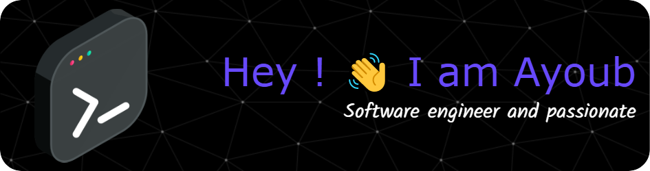

> I like coding by night, interested in : DevOps, AI/ML, DataEngineering, & webDev

 

  
:trophy: Github Stats

  <table width="100%" style="width: 100%;">
    <tbody>
      <tr>
        <td>
          
        </td>
        <td>
          
        </td>
      </tr>
      <tr>
        <td colspan="2">
          

            
          

        </td>
      </tr>
      <tr>
        <td colspan="2">
          

            
          

        </td>
      </tr>
    </tbody>
  </table>
  
     

  

 

  
 :mag: Currently learning 

  
  

  
  
  
  
  
  
  
  
  
  
  

  

 

  
 :star: Prefered Tools/Langs 

  

  
  
  
  
  
  
  
  
  
  
  
  
  
  
  
  
  
  
  
  
  
  
  
  
  
  
  
  
  
  
  
  
  
  
  
  
  
  
  
  
  
  
  
  
  
  
  
  
  
  

 

  

<h3 align="left">Connect with me:</h3>

 

